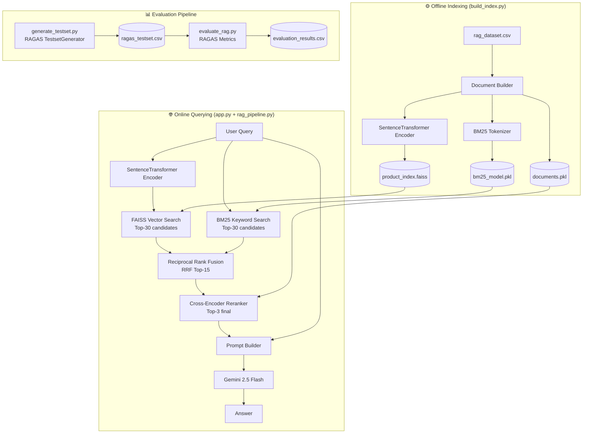

# E-commerce RAG Shopping Assistant with Hybrid Retrieval & RAGAS Evaluation

An end-to-end **Retrieval-Augmented Generation (RAG)** system built with **LangChain** for intelligent product search and recommendation in an e-commerce setting. The system combines **Hybrid Retrieval** (FAISS + BM25 + RRF) with a **Cross-Encoder Reranker** to maximize retrieval quality, and uses **Gemini** as the final answer generator. A full automated **RAGAS evaluation pipeline** is included to quantitatively measure system performance.

---

## ✨ Key Features

- **Hybrid Retrieval** — Combines dense vector search (FAISS) and keyword search (BM25) via Reciprocal Rank Fusion (RRF) for superior recall over single-method approaches.
- **Cross-Encoder Reranking** — A `ms-marco-MiniLM-L-6-v2` Cross-Encoder reranks the fused candidates to surface the most relevant products before generation.
- **Multilingual Embeddings** — Uses `paraphrase-multilingual-MiniLM-L12-v2` to handle queries in multiple languages accurately.
- **Gemini Integration** — Calls `gemini-2.5-flash` via the Google Generative AI API for high-quality, grounded recommendations.
- **Automated Evaluation (RAGAS)** — Includes scripts to auto-generate a testset and evaluate the full pipeline on 4 standard RAG metrics using an LLM-as-Judge approach.
- **Interactive Web UI** — A Streamlit chat interface with session history for real-time Q&A.
- **LangChain Framework** — Built entirely on LangChain for standardized, production-ready chain orchestration.
- **Modular Architecture** — Clean separation between offline indexing and online querying.

---

## 🏗️ System Architecture



---

## 📊 Evaluation Results (RAGAS)

The pipeline was evaluated on 15 auto-generated test questions using the [RAGAS](https://github.com/explodinggradients/ragas) framework with `gemini-2.5-flash` as the LLM Judge.

| Metric | Score | Description |
|---|---|---|
| **Context Precision** | 0.8533 | Are the retrieved documents actually relevant to the question? |
| **Context Recall** | 0.7867 | Do the retrieved documents cover all necessary information? |
| **Faithfulness** | 0.9200 | Does the answer stay grounded in the retrieved context (no hallucination)? |
| **Answer Relevancy** | 0.8733 | Does the answer directly address the user's question? |

> Testset and evaluation scripts are located in `generate_testset.py` and `evaluate_rag.py`. The generated testset is saved at `data/ragas_testset.csv`.

---

## 📁 Project Structure

```text
Naive_RAG/
├── app.py                     # Streamlit web app (main entrypoint)
├── build_index.py             # Offline indexing: builds FAISS and BM25 artifacts via LangChain
├── rag_pipeline.py            # Core LangChain pipeline: retriever chain, prompt, generation
├── generate_testset.py        # Auto-generates evaluation testset using RAGAS TestsetGenerator
├── evaluate_rag.py            # Runs RAGAS evaluation on the full pipeline
├── requirements.txt           # Python dependencies
├── .env                       # Environment variables (not committed)
└── data/
    ├── rag_dataset.csv        # Source product catalog dataset
    ├── faiss_store/           # LangChain FAISS vector store (index + docstore)
    ├── bm25_retriever.pkl     # Serialized LangChain BM25Retriever
    └── ragas_testset.csv      # Auto-generated evaluation testset (15 questions)
```

---

## 🛠️ Tech Stack

| Layer | Technology |
|---|---|
| **Framework** | LangChain (Chains, Retrievers, Prompt Templates) |
| **Web UI** | Streamlit |
| **Embedding Model** | `sentence-transformers/paraphrase-multilingual-MiniLM-L12-v2` via `langchain-huggingface` |
| **Vector Store** | FAISS via `langchain-community` |
| **Keyword Search** | BM25Retriever via `langchain-community` |
| **Fusion Strategy** | EnsembleRetriever (Reciprocal Rank Fusion) |
| **Reranker** | CrossEncoderReranker (`cross-encoder/ms-marco-MiniLM-L-6-v2`) |
| **LLM** | Google Gemini 2.5 Flash via `langchain-google-genai` |
| **Evaluation** | RAGAS v0.2.x |
| **Environment** | python-dotenv |

---

## 🚀 Getting Started

### 1. Clone the repository

```bash
git clone <your-repo-url>
cd Naive_RAG
```

### 2. Create and activate a virtual environment

```bash
python3 -m venv venv
source venv/bin/activate  # On Windows: venv\Scripts\activate
```

### 3. Install dependencies

```bash
pip install -r requirements.txt
```

### 4. Configure environment variables

Create a `.env` file in the project root:

```env
GEMINI_API_KEY=your_gemini_api_key_here
```

> Get your free API key at [Google AI Studio](https://aistudio.google.com/apikey).

### 5. Build the retrieval index

```bash
python3 build_index.py
```

This generates:
- `data/product_index.faiss` — FAISS vector index
- `data/documents.pkl` — serialized document list
- `data/bm25_model.pkl` — BM25 keyword index

### 6. Launch the web app

```bash
streamlit run app.py
```

Open the local URL shown in the terminal (typically `http://localhost:8501`).

---

## 🧪 Running the Evaluation Pipeline

### Step 1 — Generate the testset

```bash
python3 generate_testset.py
```

Uses RAGAS `TestsetGenerator` with Gemini to auto-generate 15 diverse test questions from the product catalog. Output: `data/ragas_testset.csv`.

### Step 2 — Evaluate the pipeline

```bash
python3 evaluate_rag.py
```

Runs the full RAG pipeline on each test question, then scores the results using RAGAS metrics (Context Precision, Context Recall, Faithfulness, Answer Relevancy). Output: `data/evaluation_results.csv`.

---

## 💬 Example Queries

Try these in the Streamlit chat interface:

- `Recommend a blue cotton shirt for summer`
- `What are some affordable jeans under $50?`
- `Do you have any wool sweaters from SaigonStyle?`
- `Find me a beige dress, lightweight and breathable`

The system retrieves relevant products using Hybrid Search + Reranking and generates a grounded recommendation via Gemini.

---

## 📝 Notes

- If retrieval artifacts are missing or you update the dataset, rerun `build_index.py`.
- The evaluation pipeline requires a Gemini API key with sufficient quota (the RAGAS LLM Judge makes multiple API calls per question).
- The `.env` file is excluded from version control via `.gitignore`.